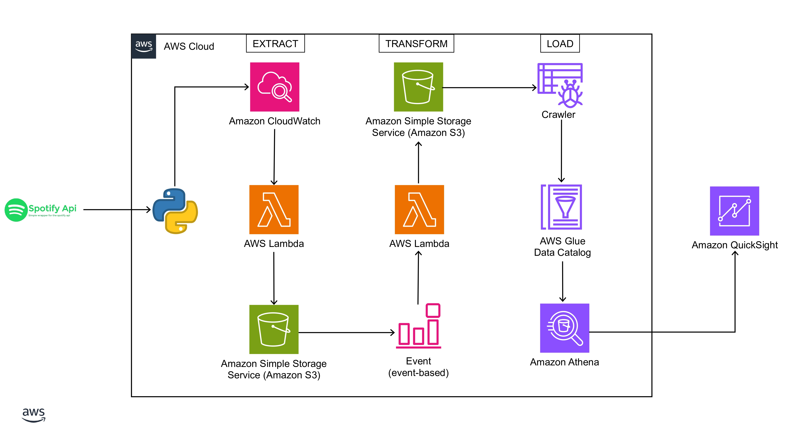

# 🎵 Spotify Data Pipeline using AWS

This project demonstrates an end-to-end **ETL (Extract, Transform, Load)** pipeline that collects data from the **Spotify API**, processes and transforms it using **AWS Lambda**, stores the data in **Amazon S3**, catalogs it with **AWS Glue**, queries it using **Amazon Athena**, and finally visualizes it in **Amazon QuickSight**.

---

## 🧩 Architecture Overview



---

## 🚀 Components

### 🔹 Extract
- **Spotify API**: Retrieves track and artist metadata.
- **Python Script**: Authenticates with the Spotify API and fetches the required data.
- **AWS Lambda (Extract Function)**: Scheduled via **Amazon CloudWatch** to extract JSON data and upload to **S3 (Raw Layer)**.

### 🔹 Transform
- **S3 Trigger → AWS Lambda (Transform Function)**:
  - Triggered when a new file is uploaded to `s3://de-spotify-analysis-raw/data/raw-json-file/`.
  - Reads the JSON file, processes and normalizes it using `pandas.json_normalize()`.
  - Writes cleaned data to `s3://de-spotify-analysis-cleaned-parquet/spotify/` in **Parquet format**.

### 🔹 Load
- **AWS Glue Crawler**: Scans the cleaned parquet files and updates the **AWS Glue Data Catalog**.
- **Amazon Athena**: Queries the structured data using SQL.
- **Amazon QuickSight**: Visualizes insights using dashboards.

---

## 📁 S3 Bucket Structure

- **Raw JSON Input**:
  - `s3://de-spotify-analysis-raw/data/raw-json-file/`
- **Transformed Parquet Output**:
  - `s3://de-spotify-analysis-cleaned-parquet/spotify/`

---

## 🛠️ Tools & Technologies

| Tool           | Purpose                              |
|----------------|--------------------------------------|
| **Spotify API** | Source of track/artist data          |
| **Python**      | API data extraction and processing   |
| **AWS Lambda**  | Serverless functions for ETL         |
| **Amazon S3**   | Data storage                         |
| **AWS Glue**    | Data catalog and crawler             |
| **Amazon Athena** | Serverless querying of S3 data     |
| **Amazon QuickSight** | BI dashboard & visualization |

---

## 🧪 How to Test the Pipeline

1. **Trigger Extraction**
   - Run the Python script or wait for the CloudWatch schedule.
2. **Trigger Transformation**
   - Ensure new raw JSON lands in `de-spotify-analysis-raw`.
   - S3 trigger should invoke Lambda transform function.
3. **Data Load**
   - Run Glue crawler to catalog new data.
   - Use Athena to run queries.
   - Visualize results in QuickSight.

---

## 🧾 IAM Roles and Permissions

Ensure the following roles have correct policies:

- Lambda: Read/Write access to both S3 buckets.
- QuickSight: `s3:GetObject` and `s3:ListBucket` for `de-spotify-analysis-cleaned-parquet`.
- Glue: `s3:GetObject`, Glue Crawler, and Data Catalog permissions.

---

## 📊 Sample Queries (Athena)

```sql
SELECT * FROM spotify.cleaned_data LIMIT 10;
